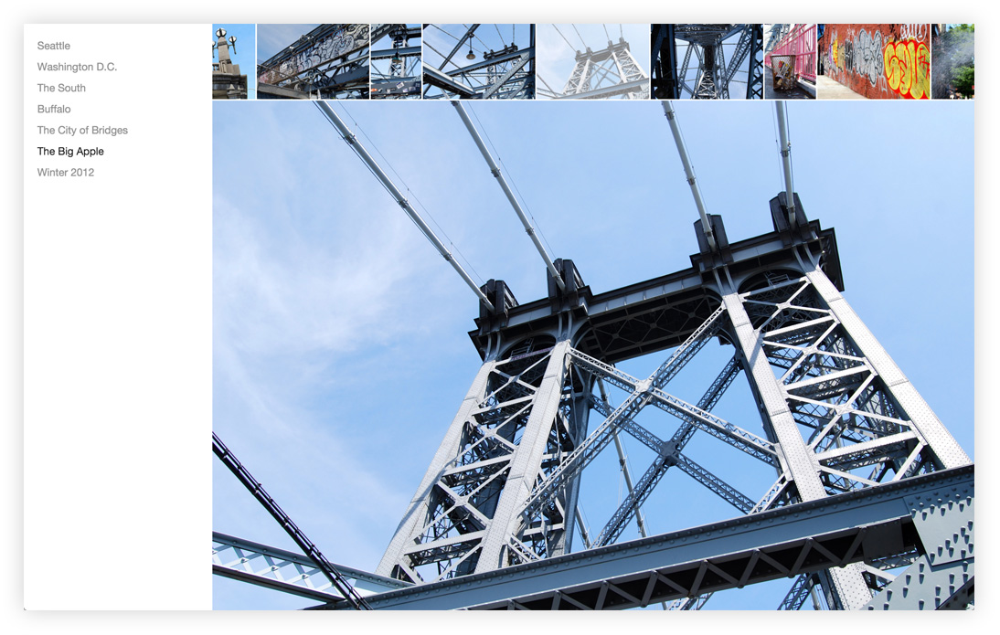

# AngularJS Flickr Components [](https://travis-ci.org/namoscato/angular-flickr)

A collection of 1.5.x [AngularJS](https://angularjs.org/) [Flickr](https://www.flickr.com/) components written in [TypeScript](http://www.typescriptlang.org/).



## Usage

1. Declare a dependency on the `amo.flickr` module:
    
    ```js
    angular.module('myModule', ['amo.flickr']);
    ```

2. After [requesting a Flickr API key](https://www.flickr.com/services/apps/create/apply/), inject the `amoFlickrConfiguration` provider into your module's run block for configuration:

    ```js
    angular
        .module('myModule')
        .config(function(amoFlickrConfigurationProvider) {

            amoFlickrConfigurationProvider
                .setApiKey('ABC123')
                .setThumbnailSize(100); // Default
        });
    ```

3. Add the `amoFlickrAlbumList` directive to your application's template:

    ```html
    <amo-flickr-album-list user-id="91374488@N07"></amo-flickr-album-list>
    ```

    or include the lower-level `amoFlickrAlbum` directive:

    ```html
    <amo-flickr-album
        album-id="72157655559181846"
        user-id="91374488@N07">
    </amo-flickr-album>
    ```

## Development

Dependencies are managed via [npm](https://www.npmjs.com/):

    npm install gulp -g
    npm install

The project is built via [gulp.js](http://gulpjs.com/):

    gulp all

and can be accessed via a local webserver:

    gulp serve
